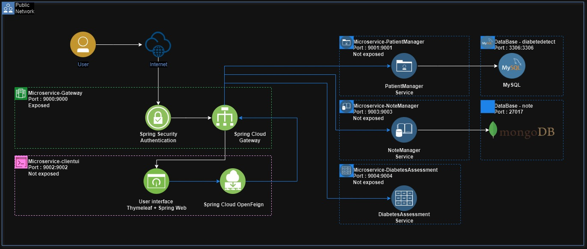
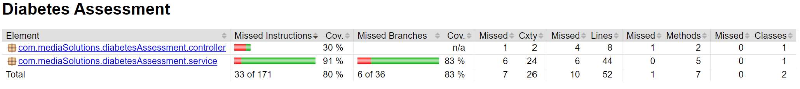

# beraud-quentin-projet-9 :
<div align="center">


<p><b>Spring boot application</b> dedicated to diabetes assessment.</p>
</div>

<div>
<div>
<h2>Contents :</h2>
<ul>
  <li><a href="#section1">Context</a></li>
  <li><a href="#section2">Architecture</a></li>
  <li><a href="#section3">Prerequisites</a></li>
  <li><a href="#section4">Run app</a></li>
  <li><a href="#section5">Jacoco Report</a></li>
  <li><a href="#section6">Green Code</a></li>
</ul>
</div>

<h2 id="section1">Context</h2>
<div>
<p>You recently joined the technical team of an international company that works with health clinics and private practices on disease risk screening.</p>

<p>The application is aimed at detecting type 2 diabetes. It is structured into multiple microservices using Spring Boot, with a 'gateway' microservice built on Spring Cloud Gateway and each microservice in the architecture has a Docker image.</p>

<p>Database normalization (3NF) has been ensured to meet ISO certification requirements, maintaining data quality and patient data access is secured with an authentication system implemented using Spring Security.</p>

<p>They are implementing a new environmental protection policy across all their projects, which means we need to adopt Green Code practices. All these new practices for implementing clean code will be detailed in the final section.</p>
</div>
<h2 id="section2">Architecture</h2>

As you can see below, there is a diagram showing the coexisting microservices that cater to the needs of the application.

After the diagram, you'll find a table listing each service along with its corresponding port in the application.



Microservice | Port | Definition
-|-|-
**Gateway** | 9000 | Manages authentication & gateway.
**Clientui**   | 9002 | Manages user interface.
**PatientManager**   | 9001 | Manages patient entities.
**NoteManager**     | 9003 | Manages note entities.
**DiabetesAssessment** | 9004 | Manages assessment of diabetes state.
**MySQL**    | 3306 | Database MySQL to store patient data.(Table : diabetedetect)
**MongoDB**    | 27017 | DataBase MongoDB to store notes data.(Database : note)


<h2 id="section3">Prerequisites</h2>
<div>
<h3>Global components :</h3>
<p>Before you can run this application, make sure you have installed the following components :</p>

Component | Version | Link
-|-|-
**JDK Development Kit** | <div align="center">17.0.10</div> | <a href="https://www.oracle.com/java/technologies/downloads/#java17">Oracle</a>
**Apache Maven**   | <div align="center">3.9.3</div> | <a href="https://maven.apache.org/download.cgi">Maven </a>
**Docker Desktop**   | <div align="center">25.0.3</div> | <a href="https://www.docker.com/products/docker-desktop/">Docker</a>
**MySQL** (Workbench)    | <div align="center">-</div> | <a  href="https://dev.mysql.com/downloads/" >MySQL</a>
**MongoDB**    | <div align="center">-</div> | <a href="https://www.mongodb.com/try/download/community">MongoDB</a>
</div>
<div>
<h3>Clone project :</h3>

After this setup, you can clone the repository locally with this cmd :

```
git clone https://github.com/qbeAccountPro/beraud-quentin-projet-9.git
```
</div>
<div>
<h3>Init Database :</h3>
<p>Now we need to setup the both database :</p>
<h4>MySQL :</h4>
<ul>
  <li>Create a locally MySQL server at 3306 port</li>
  <li>Create a database on this server named "diabetedetect"</li>
  <li>Create the table with this script : <a href="https://github.com/qbeAccountPro/beraud-quentin-projet-9/blob/main/initialData/patient_ddl.sql">patient_ddl.sql</a> </li>
  <li>Add the testing data : <a href="https://github.com/qbeAccountPro/beraud-quentin-projet-9/blob/main/initialData/data.sql">data.sql</a> </li>
</ul>
<h4>MongoDB :</h4>
<ul>
  <li>Create a locally MongoDB server at 27017 port</li>
  <li>Create a database on this server named "note"</li>
  <li>Add the testing data : <a href="https://github.com/qbeAccountPro/beraud-quentin-projet-9/blob/main/initialData/patient.JSON">patient.JSON</a> </li>
</ul>
<h3>Authentication environment variables :</h3>
<p>Next, let's add the database authentication environment variables :<br>

At the source of the project add the first ".env" file and write your authentication environment variables :

```
MYSQL_ROOT_PASSWORD=YOURSECRETPASSWORD
MYSQL_ROOT_USERNAME=YOURUSERNAME
MYSQL_ROOT_URL=jdbc:mysql://host.docker.internal:3306/diabetedetect
```

And in the micoservice-patientmanager at this relative link create the second one :
<i>patientmanager\src\main\resources</i>

```
MYSQL_ROOT_PASSWORD=YOURSECRETPASSWORD
```
You can change the username and the url if you want inside the applciation.yml file : <a href="https://github.com/qbeAccountPro/beraud-quentin-projet-9/blob/main/patientmanager/src/main/resources/application.yaml">application.yaml</a>

</p>
</div>

<h2 id="section4">Run app</h2>
<p>Before run the application you need to check that the Docker daemon is running.</p>
<p>Now you can use the JAR files present in each microservice or regenerate the JAR files for each microservice using the command : </p>

```
mvn package
```

After this, you need to create a Docker image for each microservice. Execute the specific command below at the root directory of each microservice :

```
docker build -t microservice-diabetesassessment:latest .
```
```
docker build -t microservice-notemanager:latest .
``` 
```
docker build -t microservice-patientmanager:latest .
```
```
docker build -t microservice-clientui:latest .
```
```
docker build -t microservice-gateway:latest .
```

Now you can execute the last cmd to run the application in the docker container. Execute the command below at the root of the application :

```
docker-compose up
```

If everything has proceeded smoothly, you can access the application via the gateway port (9000).

<h2 id="section5">Jacoco Report</h2>
<p>JaCoCo is a tool used in software development to ensure adequate code coverage by tests. By generating a report detailing the percentage of code covered by tests, JaCoCo helps identify gaps in testing and prioritize areas for improvement. This ensures that critical parts of the codebase are thoroughly tested, enhancing overall software quality and reliability.</p>

<p> As you can see below the screenshot of the jacoco report by microservice :</p>





</p>

<h2 id="section6">Green Code</h2>

The stakes of green code involve optimizing software to minimize energy consumption and resource usage, reducing environmental impact.

In the pursuit of optimizing software for reduced environmental impact, two online tools prove valuable : Ecoindex and Ecometer. While Ecoindex measures ecological impact, Ecometer helps identify initial strategies to mitigate it. These tools  offering insights into resource usage and guiding coder actions towards greener coding practices

Three levers contribute to lightening the ecological footprint of a website: functional frugality, container optimization, and content optimization. The approach starts with the current state of the applicationand involves implementing a series of actions to reduce the website's ecological footprint, followed by evaluating the achieved gains compared to the initial situation.
</div>